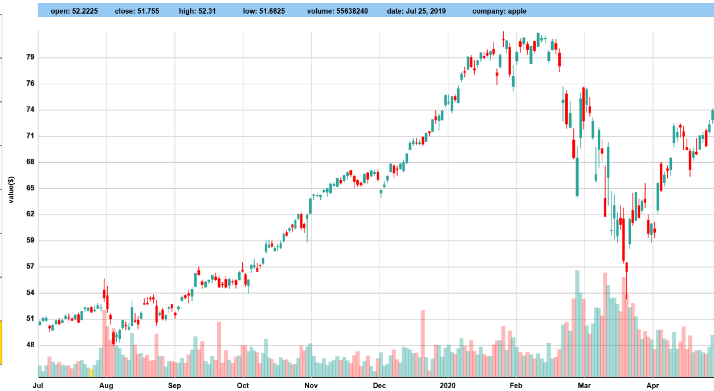

# Historical Trading Data Visualization App

## Overview

This project is a data visualization app focused on historical trading data. The app visualizes trading data using candlestick charts and allows users to simulate trading, forward the timeline, and track profit/loss. Built primarily in JavaScript, it follows an object-oriented programming (OOP) approach to maintain a structured and scalable codebase.

## Features

- Toggle Between Companies – Users can switch between different companies' candlestick and bar charts.

- Comparison Mode – Compare the trading data of two companies simultaneously.

- Animated Timeline Navigation – Navigate through different time periods with an animated timeline.

- Trading Simulation – Simulate trades based on historical data.

- Time Interval Switching – Users can switch between different time intervals for better analysis.

## ScreenShot

## Installation & Usage

- Clone the repository: git clone https://github.com/kxboon/Data-Visualisation-App

- Open index.html in a browser or set up a local server.

- Interact with the UI to visualize historical trading data and simulate trades.

- Feel free to try out other visualization tool as well!

## Technolgoes used

- Javascript

- HTML and CSS

## Future Enhancements

- Technical Indicators – Add moving averages, RSI, and other analytics.

- User Dashboard – Display trade history and overall performance.

- Real-Time Data Integration – Optionally fetch live trading data.

- Data Export/Import – Allow users to save and load trading simulations.

